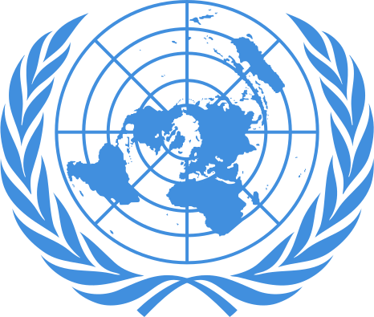

# CCO5  Desenvolvimento de Software para Web - Projeto N1

  

# Agenda ONU
Projeto sobre energia limpa e sustentável, para a disciplina de Desenvolvimento de Software para Web

  

>Objetivo 7. Assegurar o acesso confiável, sustentável, moderno e a preço acessível à energia para todas e todos

* 7.1 Até 2030, assegurar o acesso universal, confiável, moderno e a preços acessíveis a serviços de 
energia

* 7.2 Até 2030, aumentar substancialmente a participação de energias renováveis na matriz energética global.

* 7.3 Até 2030, dobrar a taxa global de melhoria da eficiência energética.

* 7.a Até 2030, reforçar a cooperação internacional para facilitar o acesso a pesquisa e tecnologias de energia limpa, incluindo energias renováveis, eficiência energética e tecnologias de combustíveis fósseis avançadas e mais limpas, e promover o investimento em infraestrutura de energia e em tecnologias de energia limpa.

* 7.b Até 2030, expandir a infraestrutura e modernizar a tecnologia para o fornecimento de serviços de energia modernos e sustentáveis para todos nos países em desenvolvimento, particularmente nos países menos desenvolvidos, nos pequenos Estados insulares em desenvolvimento e nos países em desenvolvimento sem litoral, de acordo com seus respectivos programas de apoio