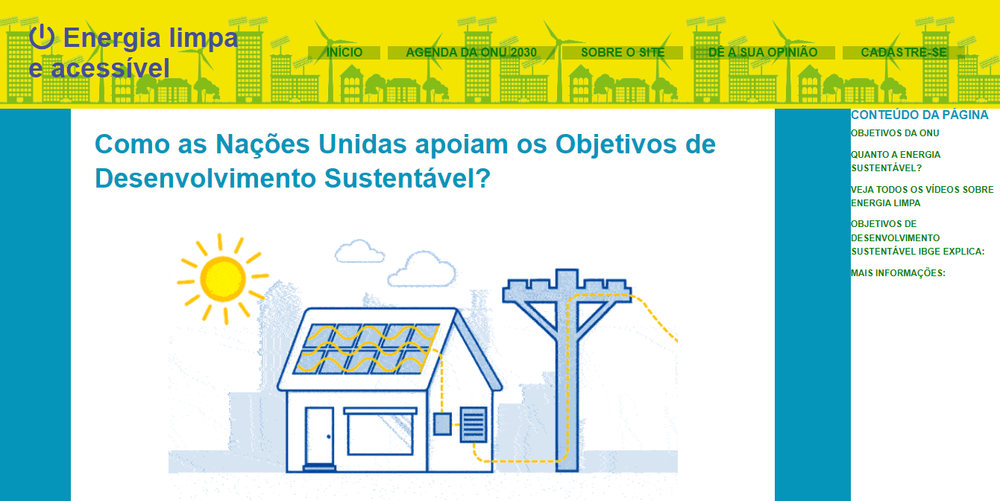

# CCO5  Desenvolvimento de Software para Web - Projeto N1

  

# Agenda ONU - Objetivo 07 Energia limpa e acessível
Projeto sobre energia limpa e sustentável, para a disciplina de Desenvolvimento de Software para Web

  

### Objetivo 7: Assegurar o acesso confiável, sustentável, moderno e a preço acessível à energia para todas e todos

## 🚀 Tecnolgias Usadas

## 💻 Deploy
Acesse esse [link](https://agenda-onu.vercel.app/) para visualizar todo o projeto!

## 💻 Video de Apresentação
Acesse esse [link](https://drive.google.com/file/d/1V6v7-3h5y-v5skhAWZ8hd43w46z-VoOH/view?usp=sharing) para visualizar o Video!
 

## 📷 Print

